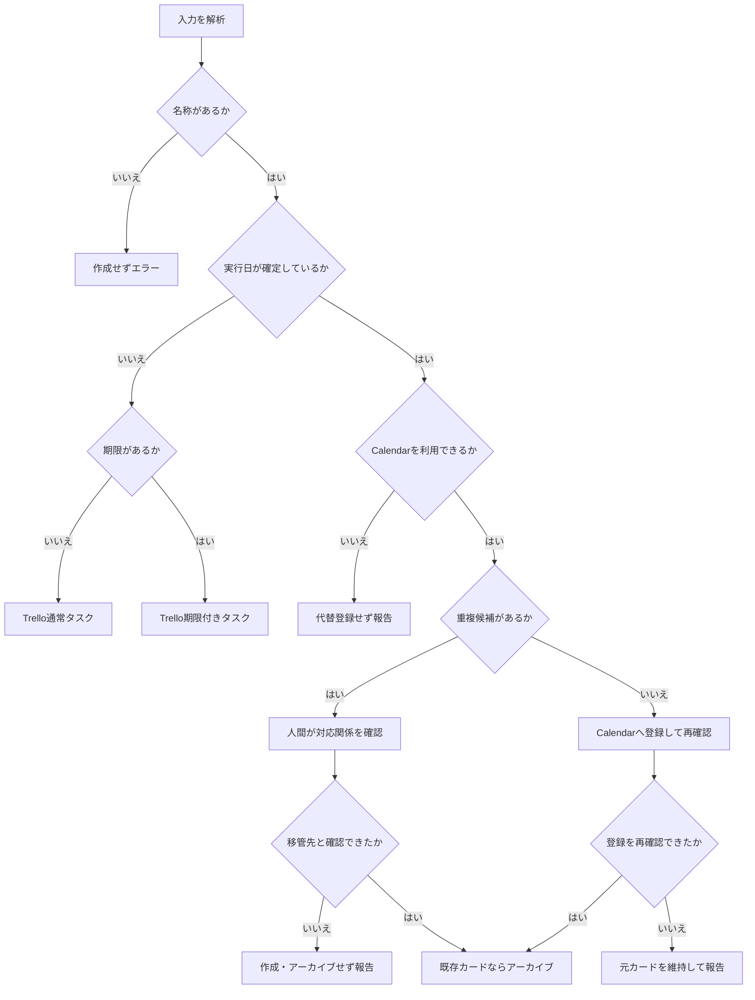

# Trello × Google Calendar タスク振り分けマスター

この文書は、AIが日付の意味を判定し、TrelloとGoogle Calendarのどちらを正本にするか決めるための共通ルールです。
日時未定のタスクと締切はTrello、実際に行う日時が確定した予定はGoogle Calendarで管理します。
同じ意味の情報を両方へ登録せず、重複・誤登録・移管時の消失を防ぎます。

## 1. 目的

本マスターは、TrelloとGoogle Calendarを使い分けるタスク・予定管理の最上位共通ルールを定義する。

タスクの内容・日時・状態・依存関係などを判定し、必要なワークフローまたは利用可能な外部ツールを選択する。

個別プロジェクト固有の工程・期限・成果物・作業方法は本マスターに記述しない。

### 全体の判断フロー



---

## 2. 基本処理

```text
ユーザー指示
↓
意図判定
↓
対象データ取得
↓
タスク構造解析
↓
条件判定
↓
必要ワークフロー選択
↓
必要ツール選択
↓
検証
↓
実行
↓
結果確認
↓
報告
```

---

## 3. 正本を分離する

同じ管理対象について、同じ意味の情報をTrelloとGoogle Calendarの両方へ登録しない。

同一案件でも「成果物の期限」と「作業する日時」は異なる管理対象として扱う。たとえば、Trelloの「9月20日までにイラストを完成」とCalendarの「9月15日19時から仕上げ作業」は併存できる。

予定日・実行日時が確定していないタスクと期限はTrelloを正本とする。

予定日または実行日時が確定している予定はGoogle Calendarを正本とし、Trelloでは管理しない。

Trelloの対象：

- タスク
- 工程
- 期限
- 完了状態
- チェックリスト
- ラベル
- カード説明
- 前提タスク
- その他Trello上の情報

Google Calendarの対象：

- 予定名
- 実行日
- 開始時刻
- 終了時刻
- 終日予定
- 場所
- 予定説明
- その他Google Calendar上の情報

AIが生成した、

- ガントチャート
- 進捗表
- 日次一覧
- 週間一覧
- 推定スケジュール
- デバッグ結果

は派生情報として扱う。

---

## 4. 日本語を標準とする

ユーザーが扱う名称・状態・メタデータは原則として日本語を使用する。

標準語彙：

```text
開始日
予定日
実行日
開始時刻
終了時刻
期限
前提タスク
完了条件
優先度
工程
完了
ブロック中
期限超過
開始待ち
実行可能
開始日未設定
```

内部ID、URL、Trello IDなどは英数字を保持する。

ユーザーが「予定日」と表現した場合は、期限ではなく実際に行う日であるかを確認し、実行日として扱う。

タイムゾーンを省略した日時は、利用環境またはユーザーが指定したタイムゾーンを使用する。タイムゾーンを確定できない場合は、外部登録前に確認する。

---

## 5. Trello基本モデル

```text
ボード
= プロジェクト

リスト
= 工程・グループ

カード
= タスク

チェックリスト
= タスク内部の詳細作業

カードID
= タスクの一意識別子
```

個別ワークフローで明示的に異なる定義がある場合は、個別定義を適用する。

---

## 6. 標準カード形式

```text
カード名：
具体的な実行内容

開始日：YYYY-MM-DD

期限：YYYY-MM-DD

前提タスク：
<TrelloカードURL>

完了条件：
<成果物・完了基準>

優先度：
低 / 通常 / 高 / 最優先

---

人間向け説明
```

すべての項目を必須にはしない。

実行日・開始時刻・終了時刻はTrelloカードへ記載しない。実行日が確定した内容はGoogle Calendarで管理する。

---

## 7. タスク入力条件

### 名称がない場合

```python
if 名称 is None:
    エラー("タスク名または予定名がありません")
    作成しない
```

### 名称がある場合

```python
if 名称:
    日付の意味を判定
    TrelloまたはGoogle Calendarのどちらか一方を選択
```

---

## 8. タスク粒度判定

```python
if 複数の独立工程を含む:
    カード分割を検討

elif 細かい連続作業のみ:
    チェックリストを使用

else:
    1カード = 1タスク
```

---

## 9. 日付条件

### 日付情報がない

```python
if 開始日 is None and 実行日 is None and 期限 is None:
    Trello通常タスクとして扱う
```

### 期限だけ存在する

```python
if 期限 and 実行日 is None:
    Trello期限管理
    Google Calendarには原則登録しない
```

例：

```text
イラスト完成期限：9月20日
```

これは締切であり、必ずしも9月20日に作業する予定ではないため、Calendar登録対象とはしない。

時刻のない期限は、その日が終わるまでを期限として日単位で判定する。現在日時との単純比較で、当日の開始時点から期限超過にしない。

### 実行日と期限が両方存在する

同じ案件に実行日と期限がある場合は、意味の異なる二つの管理対象へ分ける。

```python
if 実行日 and 期限:
    Calendar = その日時に行う作業または予定
    Trello = 期限までに完成させる成果物タスク
    相互に同一情報を複製しない
```

分割できない、または日付の意味が曖昧な場合は、登録前にユーザーへ確認する。

---

## 10. 実行日条件

実際にその日に行う予定が明確な場合は、Google Calendarだけで管理する。

```python
if 実行日:
    Trelloカードを作成しない
    Google Calendar処理へ
```

例：

```text
病院
会議
授業
外出
予約
面談
イベント
試験
提出作業
予定された制作時間
```

### 既存Trelloカードの予定日が決まった場合

日時未定でTrello管理していたカードに実行日が確定した場合は、Google Calendarへ移管する。

```python
if Trelloカード exists and 実行日:
    Google Calendar重複確認

    if 同一予定あり:
        既存予定と元カードの対応関係を人間が確認
        if 移管先として確認成功:
            Trelloカードをアーカイブ
        else:
            Trelloカードを維持して報告

    elif 重複なし:
        Google Calendar予定作成
        登録結果を再確認

        if Calendar登録成功 and 再確認成功:
            Trelloカードをアーカイブ

        else:
            Trelloカードを維持
            失敗内容を報告
```

Calendar登録を確認する前にTrelloカードをアーカイブしない。

---

## 11. Google Calendar条件分岐

### 明示的に予定登録の指定あり

```python
if カレンダー登録 == "する":
    日付の意味と必要情報を検証
    if 実行日として確定:
        Trelloカードを作成しない
        Google Calendar連携処理へ
    else:
        登録前に確認
```

---

### 実行日＋時刻あり

```python
if 実行日 and 開始時刻:
    Trelloカードを作成しない
    Google Calendar登録対象
```

ユーザーの指示内容が予定追加を含む場合は、利用可能なGoogle Calendarプラグインを使用する。

---

### 実行日のみ

```python
if 実行日 and 開始時刻 is None:
    Trelloカードを作成しない
    終日予定として扱えるか判定
```

「締切」ではなく明確なイベント・予定である場合のみ終日予定候補とする。

---

### 期限しかない

```python
if 期限 and 実行日 is None:
    Calendarへ自動登録しない
```

---

### 登録しない指定

```python
if カレンダー登録 == "しない":
    Google Calendarを呼び出さない
    Trelloへ代替登録しない
    未登録として報告
```

---

## 12. Calendar登録前検証

Google Calendarへ登録する場合は、可能な範囲で以下を確認する。

```text
予定名
予定日
実行日
開始時刻
終了時刻
場所
説明
既存予定
```

終了時刻が必要なのに不明な場合、または終了時刻が開始時刻以前の場合は、推定して登録せず確認またはエラーとする。日付をまたぐ予定は、終了日を含む完全な日時として保持する。

---

## 13. Calendar重複判定

登録前に既存Calendarを確認できる場合は重複確認する。

```python
if 同一日 and 類似予定名 and 時間帯重複:
    新規登録を停止
    重複候補として人間へ確認する

else:
    登録処理を続行
```

同一予定を重複作成しない。

類似名だけを根拠に、既存予定を移管先と断定しない。日付、時間、名称、場所、説明、元カードURLなど、利用可能な対応根拠を確認する。

---

## 14. Calendarプラグイン利用不能

```python
if Google Calendarプラグインが利用可能:
    プラグインを使用

else:
    Trelloへ代替登録しない
    Calendar登録不能を報告
```

予定日・実行日時が確定した内容は、Calendarプラグインが利用できない場合でもTrelloカードへ変換しない。

---

## 15. Calendar登録後

```python
if Calendar登録成功:
    登録結果を再検索
    if 再確認成功:
        ユーザーへ報告
    else:
        成功確定とみなさず、移管元を維持して報告

elif Calendar登録失敗:
    失敗内容を報告
```

Calendar登録に失敗した予定をTrelloへ代替登録しない。

移管元のTrelloカードのアーカイブに失敗した場合は、Calendar登録済み・移管未完了として報告し、二重登録状態を隠さない。

---

## 16. 開始日条件

```python
if 開始日:
    スケジュール解析に使用

else:
    開始日未設定として扱う
```

開始日がないこと自体はエラーではない。

開始日はタスク管理上の着手可能日であり、実際に作業する予定日とは扱わない。

---

## 17. ガント条件

```python
if 開始日 and 期限:
    ガント生成可能 = True

else:
    ガント生成可能 = False
```

### 開始日なし

```text
通常タスク管理
= 可能

ガント
= 生成対象外
```

---

## 18. 前提タスク条件

```python
if 前提タスク is None:
    依存関係なし

elif 前提タスク exists:
    完了状態を確認

else:
    エラー("前提タスクが存在しません")
```

---

## 19. ブロック判定

```python
if 前提タスク and 前提タスクが未完了:
    状態 = "ブロック中"
```

ブロック中タスクは「次に実行可能なタスク」から除外する。

---

## 20. 完了判定

Trello上の正式な完了状態を優先する。

```python
if Trello完了状態 == True:
    状態 = "完了"
```

説明欄に「完了」と書かれているだけでは正式完了にしない。

---

## 21. 状態矛盾

```python
if 説明に完了記載あり and Trello完了状態 == False:
    警告("完了状態が矛盾しています")
```

AIが勝手に完了へ変更しない。

---

## 22. 期限超過

```python
if 完了 == False and 期限 < 現在日時:
    状態 = "期限超過"
```

---

## 23. 開始待ち

```python
if 開始日 and 開始日 > 現在日:
    状態 = "開始待ち"
```

---

## 24. 実行可能

```python
if 完了 == False \
and 前提タスク未完了 == False \
and 開始日 <= 現在日:
    状態 = "実行可能"
```

開始日未設定の場合は、個別ワークフローの規則に従う。

---

## 25. 標準状態判定

優先順位：

```python
if 完了:
    return "完了"

if 前提タスク未完了:
    return "ブロック中"

if 期限 and 期限 < 現在日時:
    return "期限超過"

if 開始日 and 開始日 > 現在日:
    return "開始待ち"

if 開始日 is None:
    return "開始日未設定"

return "実行可能"
```

状態は一つを返すが、期限超過などの重要な事実は警告フラグとして併記できる。たとえば前提未完了かつ期限超過の場合、主状態は「ブロック中」、警告は「期限超過」とする。

---

## 26. 優先度

```text
低
通常
高
最優先
```

未設定：

```python
if 優先度 is None:
    内部比較では通常相当として扱ってよい
    Trello上へ正式値として自動記入しない
```

---

## 27. 完了条件

```python
if 完了条件:
    タスク評価に使用

else:
    タスク管理は継続
```

完了条件未設定はエラーとしない。

---

## 28. 読み取り条件

ユーザー指示が以下の場合：

```text
確認
検索
分析
整理
進捗
ガント
デバッグ
一覧
```

原則：

```python
読み取りのみ
Trelloを書き換えない
```

---

## 29. 書き込み条件

ユーザー指示が、

```text
追加
作成
変更
更新
移動
完了
削除
登録
```

など明確な変更操作を含む場合、

```python
書き込み処理 = True
```

として必要なプラグインを使用する。

削除・アーカイブ・大量変更は、対象と件数を特定し、ユーザーの変更意図が明確な場合だけ実行する。削除より復旧可能なアーカイブを優先する。

---

## 30. 外部プラグイン選択

タスク処理中に外部システムが必要な場合は、利用可能な対応プラグインを使用する。

```python
if 日時未定タスク or 期限管理:
    Trelloプラグイン

elif 予定日・実行日時が確定:
    Google Calendarプラグイン
```

一つの内容について必要のないプラグインを呼び出さず、TrelloとGoogle Calendarへ二重登録しない。

---

## 31. 登録先の選択

一つの内容は、日付の意味に応じてTrelloまたはGoogle Calendarのどちらか一方へ登録する。

例：

```text
「9月5日9時に病院へ行く」
```

処理：

```text
内容解析
↓
実行日時が確定していると判定
↓
Google Calendar確認
↓
重複チェック
↓
Google Calendar予定作成
↓
登録後に再検索
↓
報告
```

この場合、Trelloカードは作成しない。

一つの指示に複数の独立した内容が含まれる場合は、内容ごとに登録先を判定する。

## 32. 具体例

| 入力 | 判定 | 正本 |
| --- | --- | --- |
| 絵の具を買う | 日付のないタスク | Trello |
| 8月18日までに絵の具を買う | 買い物の期限 | Trello |
| 8月18日18時に画材店へ行く | 実行日時が確定した予定 | Google Calendar |
| 2026年9月5日9時に病院を受診する | 実行日時が確定した予定 | Google Calendar |
| 9月20日までにイラストを完成させる | 制作期限 | Trello |
| 9月15日19時から21時まで仕上げ作業をする | 制作時間 | Google Calendar |

詳細は `examples/routing-examples.md` を参照する。

---

## 33. 情報不足

正式値としてAIが勝手に補完しない。

対象：

```text
開始日
予定日
実行日
時刻
期限
前提タスク
完了条件
優先度
完了状態
```

ただし、処理に必須ではない項目の不足によって全体を停止しない。

---

## 34. 推定

推定が必要な場合：

```text
事実：
実行日 = 2026-09-05

推定：
移動開始候補 = 07:30

提案：
07:30からCalendarに移動予定を登録
```

のように分離する。

---

## 35. データ検証

必要に応じて確認する。

```text
カードID
カード名
工程
開始日
期限
完了状態
前提タスク
完了条件
優先度

予定名
予定日
実行日
開始時刻
終了時刻
場所
予定説明
```

---

## 36. 検証結果

```text
エラー
警告
情報
処理ブロック
```

に分類する。

---

## 37. 部分実行

一つの指示に複数の独立した内容がある場合、一部の処理が失敗しても独立して実行可能な処理は続行する。

```python
if Calendar予定登録失敗:
    Trelloへ代替登録しない
    Calendar失敗を報告

if Trello失敗:
    Trelloを前提とする後続処理を停止
```

---

## 38. デバッグ条件

ユーザーが、

```text
デバッグ
検証
チェック
```

と指定した場合：

```python
変更処理を原則停止
検証処理を優先
```

以下を確認する。

```text
ソース取得
カード構造
日付
依存関係
完了状態
Calendar条件
重複
処理可能性
```

---

## 39. 出力選択

ユーザー要求から必要な出力を選択する。

```python
if 今日の予定:
    Google Calendarから今日の予定を生成

if 今週の予定:
    Google Calendarから今週の予定を生成

if 今週のタスク:
    Trelloから今週対象のタスクを生成

if 遅延:
    期限超過一覧を生成

if ガント:
    ガント生成条件を検証
    ガントを生成

if 次に何をする:
    実行可能タスクを抽出

if デバッグ:
    デバッグレポートを生成
```

---

## 40. 個別ワークフロー

個別案件の詳細処理はマスターへ直接追加しない。

例：

```text
大学課題
電子工作
ブログ
旅行
生活
購入
```

必要な場合は対応ワークフローを選択する。

---

## 41. 最終条件分岐

```text
タスク発生
│
├─ 日付なし
│   └─ Trello通常タスク
│
├─ 期限あり
│   └─ Trello期限管理
│
├─ 実行日あり
│   └─ Trelloには登録しない
│       ├─ Google Calendar利用可能
│       │   ├─ 重複あり → 登録停止・報告
│       │   └─ 重複なし → Calendar登録・再検索
│       │
│       └─ Google Calendar利用不能
│           └─ 未登録として報告
│
├─ 既存Trelloカードの実行日が確定
│   └─ Calendar確認
│       ├─ 同一予定との対応関係を確認成功 → Trelloカードをアーカイブ
│       ├─ 新規登録・再確認成功 → Trelloカードをアーカイブ
│       └─ 登録失敗 → Trelloカードを維持・報告
│
├─ 開始日＋期限あり
│   └─ ガント生成可能
│
├─ 前提タスクあり
│   ├─ 完了 → 実行判定へ
│   └─ 未完了 → ブロック中
│
└─ 期限超過
    └─ 期限超過タスクとして抽出
```

---

## 42. 禁止事項

禁止する。

```text
期限だけを理由にCalendarへ自動登録する

推定日時を正式予定として無断登録する

同一Calendar予定を重複登録する

予定日・実行日時が確定した内容をTrelloへ登録する

同じ内容をTrelloとGoogle Calendarへ二重登録する

Calendar登録に失敗した予定をTrelloへ代替登録する

Calendar登録確認前に移管元のTrelloカードをアーカイブする

読み取り指示でTrelloを書き換える

不足情報を事実として補完する

個別案件ルールをマスターへ追加する
```

---

## 43. AIへの渡し方

1. 本文書をファイル添付、プロジェクト知識、または参照可能なリポジトリとしてAIへ渡す。
2. 「この文書をタスク管理の運用ルールとして使用する」と明示する。
3. 初回は読み取り専用で、入力例の振り分けだけを確認する。
4. 判定が正しいことを確認してから、外部サービスへの登録を依頼する。

AIへ渡す指示例：

```text
添付した task-routing-master.md を、この会話のタスク管理ルールとして使用してください。
登録前に日付が期限・開始日・実行日のどれかを判定し、同じ意味の情報を二重登録しないでください。
外部サービスを変更した場合は結果を再確認し、確認できなければ成功扱いにしないでください。
```

詳しい導入方法は `docs/ai-setup.md` を参照する。

---

## 44. テスト状況

- 文書構造・内部リンク・必須ルールの静的検証：実施済み
- 判断ロジックの公開テストケース：`TESTING.md` に記載
- Trello実操作：公開版では未実施
- Google Calendar実操作：公開版では未実施
- TrelloからCalendarへの実移管：公開版では未実施

外部サービスの結合テストは、実在するカード名、予定名、URL、ID、個人情報を公開せず、利用者自身の検証環境で行う。

---

## 45. 最終原則

```text
Trello
= 予定日・実行日時が未確定のタスクと期限の正本

Google Calendar
= 予定日・実行日時が確定した予定の正本

同一内容
= TrelloとGoogle Calendarのどちらか一方だけで管理

期限
≠ 実行予定日

開始日
= タスク開始予定

予定日
= 実際に行う日
= Google Calendarで管理

実行日
= 実際に行う日
= Google Calendarで管理

ChatGPT
= 条件判定・ツール選択・検証・実行
```

条件を満たす場合のみ必要なプラグインを使用する。

プラグインを使用する必要がない場合は呼び出さない。

一部の外部処理が失敗しても、独立して実行可能な処理は継続する。
